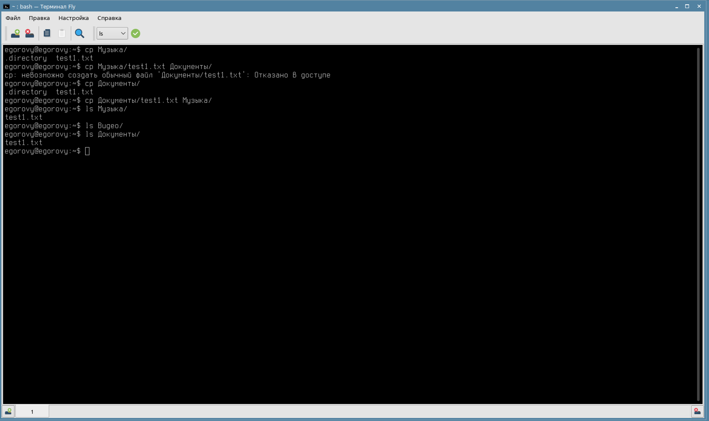

# Практическая работа 4.2 Егоров Ю.А

## Шаги выполнения

### 1. Настройки мандатного управления доступом

### 2.Зададим новые уровни целостности для тестовых файлов

### Проверка уровня контроля

### Режим замкнутой программной среды (ЗПС)

### Работа с утилитами контроля целостности и регламентного контроля целостности
   
