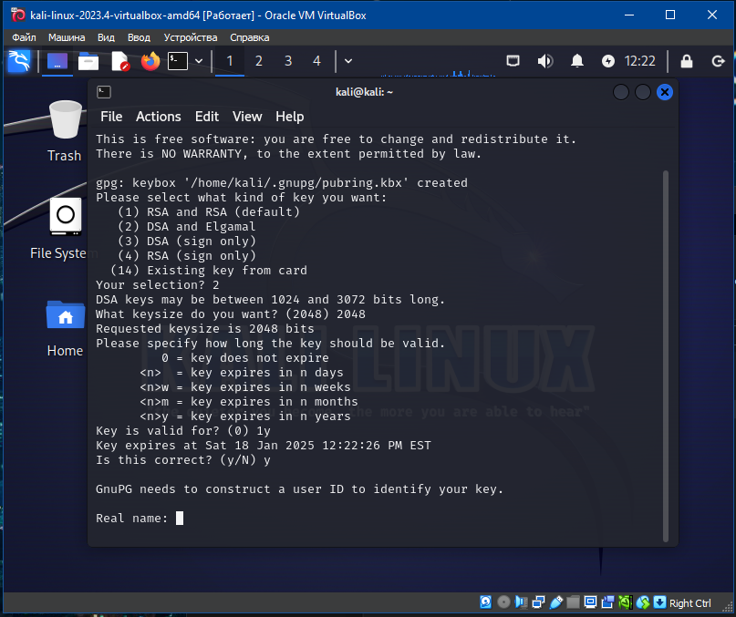
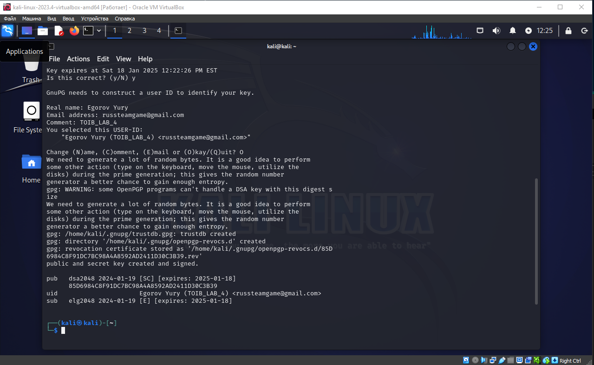
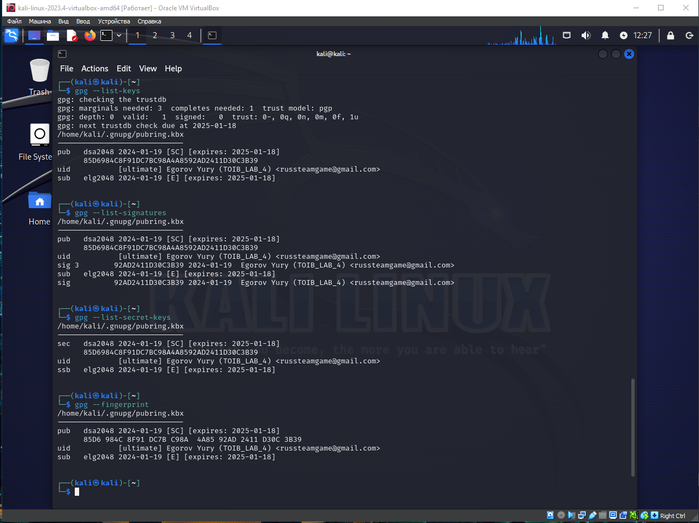
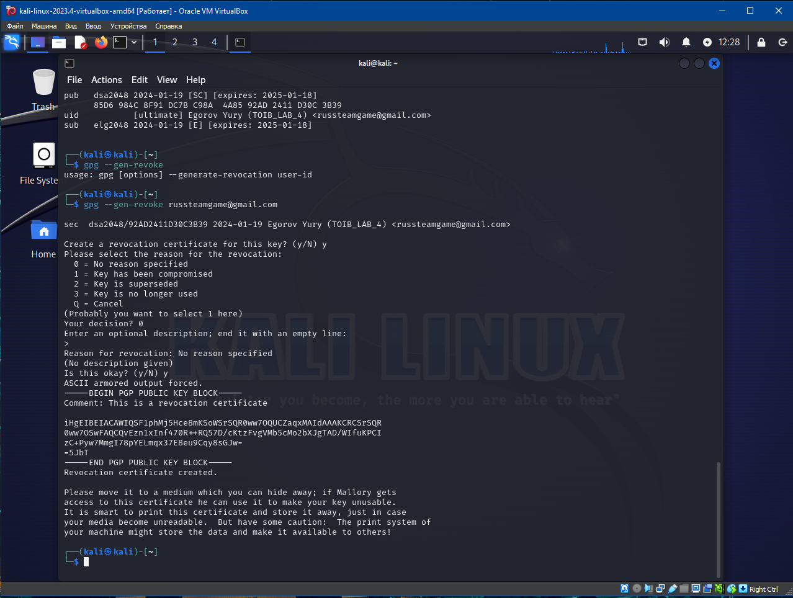
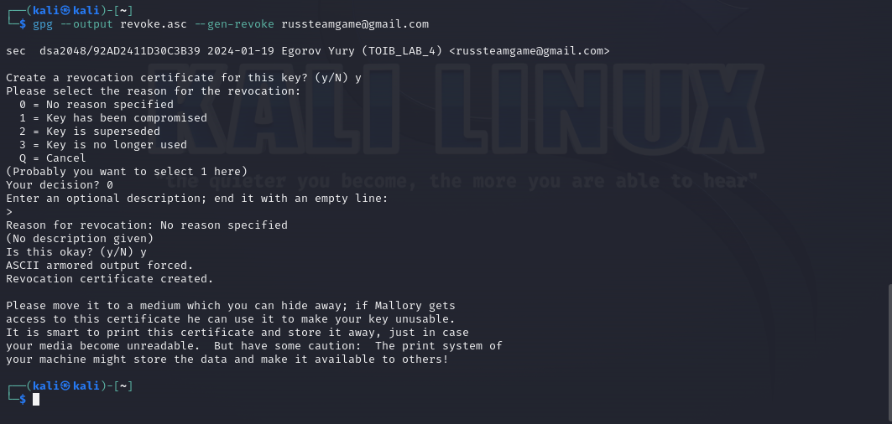
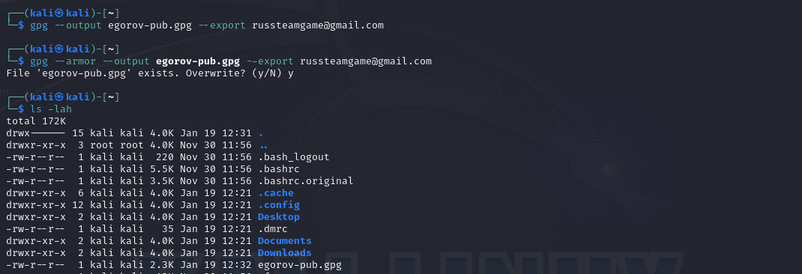
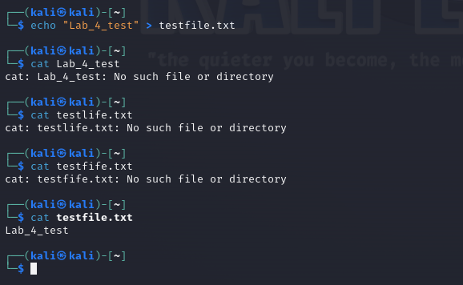
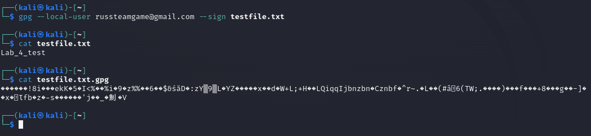
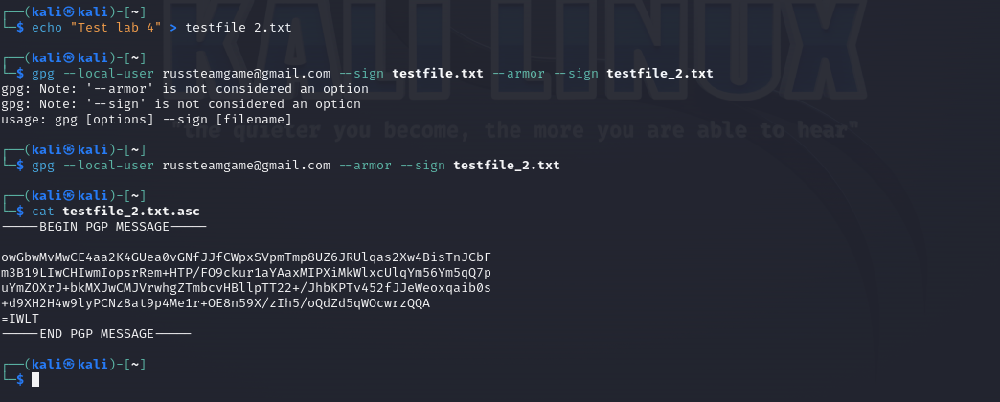
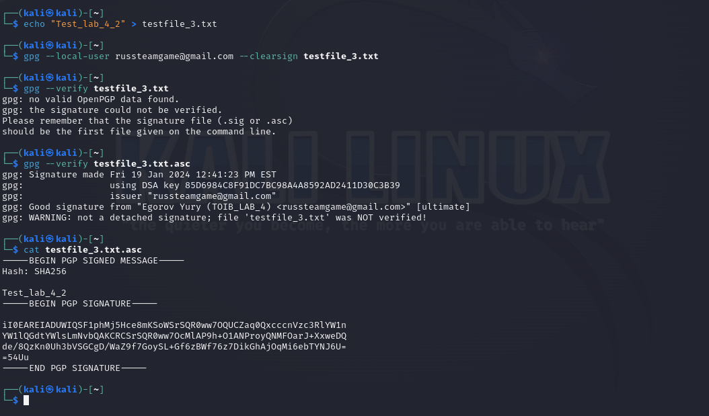

# Лабораторная работа 4

Выполнил Егоров Ю.А. ББМО-01-23

## Создание пары GPG

## Просмотр созданных ключей, подписей, отпечатков

## Создание отзывающего сертификата

## Запись сертификата в файл:

## Экспорт публичного ключа в бинарном и текстовом виде

## Создание файла для подписи

## Создание подписи в бинарном виде

## проверка подписи

## Создание подписи в формате ASCII

## Создание подписи, вставленной в содержимое файла

